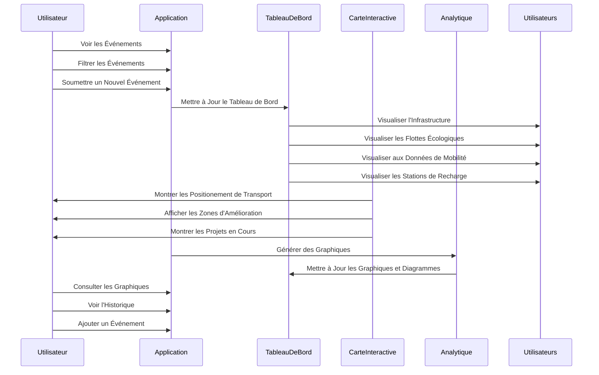

```mermaid.js
sequenceDiagram
    participant Utilisateur
    participant Application
    participant TableauDeBord
    participant CarteInteractive
    participant Analytique

    Utilisateur->>Application: Voir les Événements
    Utilisateur->>Application: Filtrer les Événements
    Utilisateur->>Application: Soumettre un Nouvel Événement
    Application->>TableauDeBord: Mettre à Jour le Tableau de Bord
    TableauDeBord->>Utilisateurs: Visualiser l'Infrastructure
    TableauDeBord->>Utilisateurs: Visualiser les Flottes Écologiques
    TableauDeBord->>Utilisateurs: Visualiser aux Données de Mobilité
    TableauDeBord->>Utilisateurs: Visualiser les Stations de Recharge
    CarteInteractive->>Utilisateur: Montrer les Positionement de Transport
    CarteInteractive->>Utilisateur: Afficher les Zones d'Amélioration
    CarteInteractive->>Utilisateur: Montrer les Projets en Cours
    Application->>Analytique: Générer des Graphiques
    Analytique->>TableauDeBord: Mettre à Jour les Graphiques et Diagrammes
    Utilisateur->>Application: Consulter les Graphiques
    Utilisateur->>Application: Voir l'Historique
    Utilisateur->>Application: Ajouter un Événement
```